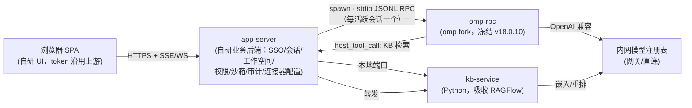

# 建设方案 —— 内网 WorkBuddy 风格 AI Web 服务

> 2026-08-29。三个输入：功能原型 `resource/workbuddy-live-demo.html`（行为基准，本身即网页形态）、
> fork 源码（`resource/ragflow`、`resource/oh-my-pi`，选型见 `resource/backend-research.md`）、
> 上游应用参考副本（`app-reference/`，结构结论见 `app-reference/analysis/00-overview.md`）。
> 本文只到"建什么、用什么建、分几步"，不含详细 spec；细节一律指向既有文档。

## 1. 定位

面向内网部署的**多用户 AI Agent Web 服务**：浏览器访问，服务端集中承载账号隔离
（每账号沙箱 + 权限 + 审计）、工作空间文件、专家/技能/连接器与内建知识库，
全链路无公网依赖。产品形态与交互以 live demo 为准——demo 里能点出来的行为就是需求。

## 2. 总体架构与代码来源（结论先行）

| 模块 | 来源 | 依据 |
|---|---|---|
| 浏览器 SPA | **自研**，demo 即形态基准（设计 token 取自上游 5.3.11，已在 demo 文件头与 `ATTRIBUTION.md` 标注）；上游 renderer 的聊天三层渲染管线（`analysis/02-renderer-ui.md`）作实现参照，源码不复用 | demo 全部页面 |
| app-server | **自研**。服务域划分参照上游 daemon（workbuddy-server：认证/会话/项目/connector/MCP/专家，`analysis/00-overview.md` §4.1）；上游源码为腾讯版权，不复用 | demo 行为 + 上游服务域 |
| agent 后端 | **omp fork**（MIT，定死 `33cc6b9a`/v18.0.10），服务端子进程 `omp --mode rpc`，每活跃会话一个，app-server 管生命周期 | `backend-research.md` §2 |
| 知识库（解析/切片/检索/agentic 环） | **吸收 RAGFlow**（Apache-2.0）组装为 kb-service；吸收/跳过清单见研究文档 | `backend-research.md` §1 |
| 账号 / 权限 / 沙箱 / 审计 | **自研**。沙箱 = 服务端每账号根目录（demo 已按 `/data/workbuddy/<user>` 建模），越界拒绝入审计 | demo `/center` 权限/审计/账号页 |
| 会话持久化 | omp `SessionManager`（`.jsonl`，resume/fork）+ app-server 侧索引与元数据 | `backend-research.md` §2.1 |
| 许可 | 根级 `LICENSE` = Apache-2.0；归属义务见 `ATTRIBUTION.md` | 已定稿 |

**架构决策**：

1. **与上游的对应关系**：上游是桌面三层（Electron 主进程 → daemon → CLI sidecar）。
   本项目是 web 服务，Electron 壳**无对应物**；参照价值最大的是上游 daemon
   （业务后端服务域）≈ 本项目 app-server，CLI sidecar ≈ omp-rpc。
2. **omp 仍走子进程 RPC，不走进程内 SDK**。web 形态下 SDK 技术上变得可行
   （app-server 选 Bun 运行时即可），但不选：单进程承载全部用户会话，一崩全站；
   每会话独立子进程天然给出崩溃隔离、每用户 cwd、资源限额。**[INFERENCE]**
   多用户服务下隔离价值大于进程内调用的延迟收益。
3. **多租户自研**：权限/可见范围/审计全在 app-server 层（这也是当初弃 Dify 的原因
   ——其许可禁多租户）。omp 与 kb-service 不感知租户，只拿到已过滤的输入。

## 3. 功能清单（以 demo 行为为准）

### 3.1 会话页（`/`）
- 三场景（日常办公 / 代码开发 / 创意设计），场景决定默认专家与工具面。
- 会话分组侧栏：项目 / 工作空间 / 专家团；会话按账号隔离。
- 流式对话（SSE/WS 到浏览器）、执行步骤卡片、agentic 检索卡
  （改写 → 召回 → 充分性判定 → 二轮 → 仅切片入上下文）。
- 附件引用两种语义：知识库（检索后只带回切片）vs 工作空间（整份文件交给助手读）。

### 3.2 工作空间与文件（`/files`）
- 工作空间为一等实体，每空间一棵多根目录树：空间根目录（账号沙箱内）+ 服务端挂载目录
  （本地磁盘 / SFTP / NFS / SMB，支持只读与在线状态）。
- 空间内可新建目录、挂载/卸载、新建工作空间；文件预览（文本/代码/图片等）。
- 所有写操作受账号沙箱约束，越界拒绝并记审计。

### 3.3 中心（`/center`，8 个 tab）
- **专家**：内置专家卡片（分类/标签），加入会话。
- **技能**：技能清单与启停。
- **连接器**：MCP 连接器（仅显式配置，不自动发现；对应 omp 的 MCP client）。
- **知识库**：12 种切片模板（对应 RAGFlow chunk_method）、RAPTOR/知识图谱开关、
  文档摄取与状态、检索测试；可见范围 仅自己/本部门/项目组/全员，共享一律只读，
  跨账号检索记审计。
- **模型**：内网自建模型注册表（对话/嵌入/重排模型登记与探活）。
- **权限**：每账号沙箱根目录、白名单规则派生、越界拦截记录。
- **审计**：权限事件、共享知识库检索事件、账号操作，按账号隔离。
- **账号**（仅管理员）：身份字段由内网统一身份下发（不可改），管理员管应用侧属性
  （角色/配额/启停）与跨部门项目组；项目组只影响知识库共享范围，不改沙箱边界。

### 3.4 设置（`/settings`）
- 主题（亮/暗）、通用项、关于；登录态与退出（内网统一身份）。

### 3.5 相对上游裁掉的东西
- **UX 层**（demo 文件头已列）：分享/微信、SaaS 连接器、市场热度、计费倍率、版本更新、积分。
- **架构层**：桌面壳整层（Electron 打包/深链/原生菜单/本地文件桥/Squirrel 更新——web 形态
  无对应物）、遥测上报全家桶（Aegis/QIMEI/OpenTelemetry 出网）、E2B 云沙箱
  （服务端本地沙箱保留）、公网网关（copilot.tencent.com 等）、腾讯文档在线预览（本地预览保留）。

## 4. 建设阶段

| 阶段 | 交付 | 验收（一行） |
|---|---|---|
| **P0 链路骨架** | app-server 骨架（登录桩 + 静态 SPA 托管）+ spawn 官方全量 `omp --mode rpc` + 内网 provider 接通 | 浏览器里一次流式对话渲染完整，会话文件落盘可 resume |
| **P1 会话与工作空间** | 会话分组/隔离、服务端多根文件树 + 挂载（SFTP/NFS/SMB）、沙箱强制与白名单、文件预览、omp 子进程生命周期管理（每活跃会话一个，空闲回收） | demo `/files` 的全部操作在真实文件系统上等价可用，越界写被拒且入审计 |
| **P2 知识库** | kb-service（deepdoc 解析 + 模板切片 + 混合检索 + agentic 环）、host tool 经 app-server 转发、宿主侧权限过滤 | 摄取一批真实文档后，会话内引用知识库能给出带出处的切片引用，共享库检索入审计 |
| **P3 账号权限审计** | 内网 SSO 真对接、项目组、管理员面板、审计事件流全覆盖 | 两个浏览器双账号实测：互看不见对方会话/文件/私有库，共享库只读 |
| **P4 减肥与部署** | omp 减肥（`backend-research.md` §2.2 阶段 1→4）、onnx/嵌入模型内网分发、部署产物（内网单机部署包） | 冒烟脚本全绿 + 减肥验收指标达标，无公网服务器上全新部署跑通 |

顺序纪律：P0 用官方全量 omp 二进制，减肥推迟到 P4——先证明链路，再优化体积。
P2 依赖 P1 的沙箱（文档存放在所有者沙箱内）；P3 的项目组依赖 P2 的共享范围模型。

## 5. 边界与风险

- **上游代码边界**：`app-reference/` 只作架构与行为参照，源码不进产物；若将来取得腾讯授权
  再议复用，届时更新 `ATTRIBUTION.md`。
- **并发资源治理**：每活跃会话一个 omp 子进程，数量上限/内存限额/空闲回收策略需在 P1
  实测定参；并发上来后可参照上游 CLI 预热池思路（`analysis/00-overview.md` §2）。
- **omp 冻结**：无上游安全修复自动跟进，高危 CVE 时自修或例外 cherry-pick（届时定）。
- **RAGFlow 吸收成本**：Python 3.13 依赖面大、deepdoc 模型需内网预置、`api.db` 耦合层要重写
  ——这是 P2 的主要工作量。
- **SSO 未定**：账号页假定"内网统一身份下发"；若身份源自带组概念（LDAP group 等），
  项目组应改为同步而非自建（待用户方信息）。
- 吸收 RAGFlow 源码落地时，`ATTRIBUTION.md` §3 的条件义务（LICENSE-RAGFlow/NOTICE/文件头）生效。
