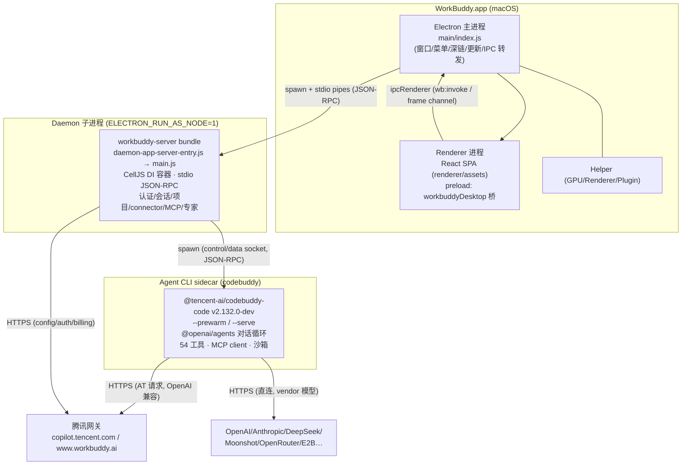
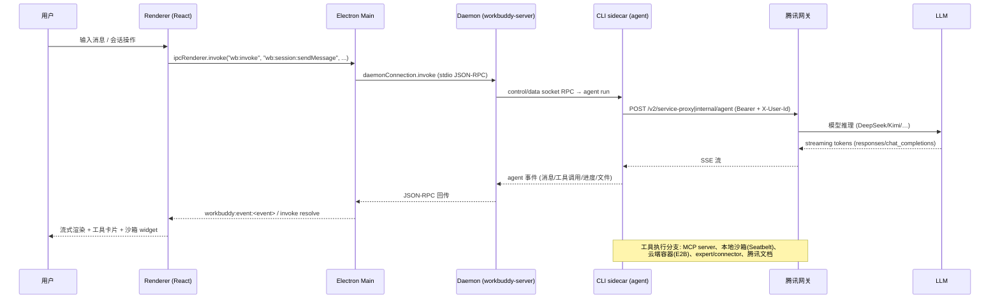

# WorkBuddy AI 5.4.2 应用结构分析 — 总览报告

> 目标：`WorkBuddy-darwin-arm64-5.4.2.36857725-d74591c4.dmg`（腾讯 WorkBuddy AI 桌面端，macOS arm64）
> 分析范围：前端 UI、后端逻辑、数据流全部内容。只读分析，未修改任何源码/资源。
> 子报告：`01-main-process.md`（主进程）、`02-renderer-ui.md`（前端 UI）、`03-cli-backend.md`（CLI 后端）、`04-native-modules.md`（原生层）。

---

## 0. TL;DR

- **产品**：腾讯 WorkBuddy AI Desktop v5.4.2（`com.workbuddy.workbuddy-ai`），AI Agent 桌面应用（Chat + 项目/工作台 + 文档 + 专家/Connector/MCP 生态）。
- **外壳**：标准 Electron 37.10.3 / Chromium 138.0.7204.251 / Node 22.16.0（macOS arm64），Squirrel.Mac 更新框架。
- **三层进程模型**：Electron 主进程 → **Daemon 子进程**（`ELECTRON_RUN_AS_NODE=1`，workbuddy-server 业务后端，stdio JSON-RPC）→ **Agent CLI sidecar**（内嵌 `@tencent-ai/codebuddy-code` v2.132.0-dev，CodeBuddy Code 终端 agent）。
- **前端**：React 18 + 自研 TodoUI（dui/lib-chat-ui）+ Jotai + React Router，Vite/rolldown 打包；与主进程经 preload `contextBridge` 暴露的 `workbuddyDesktop` 桥通信，业务 RPC 走 `wb:invoke` → daemon。
- **AI 数据流**：renderer → IPC → daemon → CLI sidecar（agent 循环）→ 腾讯网关 `copilot.tencent.com` / `www.workbuddy.ai`（OpenAI 兼容）→ 模型（DeepSeek v4 / Kimi K2.x / Qwen / 混元等，服务端路由）→ SSE 回流渲染。
- **能力面**：54 个内置 agent 工具、MCP client（stdio/HTTP/SSE）、E2B + 本地 Seatbelt 沙箱、腾讯文档预览/导入（docs.qq.com + 本地引擎）、微信/飞书/钉钉/Slack/QQ 机器人 Connector、专家市场、插件市场、OpenTelemetry + Aegis + 腾讯 QIMEI 设备指纹上报。
- **安全加固**：凭证 AES-256-GCM 字段级加密（`~/.workbuddy` 之外的 shared 目录）、fs-monkey-patch 防护、TuringShield（macOS 显式禁用）、网关密钥注入（修复 sidecar RCE）、XTI 内容安全检测。

---

## 1. 技术栈画像

| 层 | 技术 |
|---|---|
| 框架 | Electron 37.10.3（Chromium 138.0.7204.251）、electron-builder + Squirrel.Mac |
| 主进程 | esbuild/rolldown 编译的 TS bundle（含 `//#region src/...` 原始路径注释，可读性好） |
| 后端（daemon） | workbuddy-server（CellJS DI 容器），drizzle ORM + better-sqlite3，输出 stdio JSON 帧 |
| CLI | `@tencent-ai/codebuddy-code` v2.132.0-dev（commander CLI + `@openai/agents` 0.5.2 对话循环） |
| 前端 | React 18.3.1 + TodoUI（自研 dui/lib-chat-ui）+ Jotai/Immer + React Router；Vite(rolldown)；pdfjs-dist 5.4.296 / KaTeX / Mermaid / Excalidraw / Shiki |
| 模型接入 | OpenAI 兼容网关（copilot.tencent.com / workbuddy.ai）+ 第三方直连（OpenAI/Anthropic/DeepSeek/Moonshot/Groq/OpenRouter/GitHub Copilot/E2B 等） |
| 协议 | ACP（Agent Client Protocol，agentclientprotocol.com）、MCP（SDK 1.29.0）、WebSocket、SSE |
| 原生模块 | turing_sdk（TuringShield）、wechat-copydata-decoder（Win 专用）、qimei-node（QIMEI 指纹）、node-pty、better-sqlite3、koffi（Win FFI） |

---

## 2. 进程模型



- **主进程**：单例锁、窗口（含 splash）、原生菜单、深链 `workbuddy://`、自动更新（`/v2/update`）、DevTools 终端、凭证保护。**没有自己的 HTTP server**（`server.js` 是 workbuddy-server bundle；HTTP 只在 CLI sidecar `--serve` 时起 `127.0.0.1` 端口）。
- **Daemon**：真正的业务后端（认证、会话持久化、项目、connector、MCP 配置、专家/技能、遥测）。启动经 `StartupPipeline` 6 阶段状态机（PreAppInit → AppConfig → WindowBringup → DaemonBringup → RendererReady → PostReady），daemon 就绪才有 `__bootstrap`。
- **CLI sidecar**：`cli-prewarm-pool.js` 预启动池（预热后调用 ~1ms）；崩溃由 DaemonAppServerProcessManager 按策略 respawn。

---

## 3. 前端 UI 架构（renderer）

- **入口**：`renderer/index.html` → 主 chunk `index-D3SrJ2Mw.js`（= `packages/workbuddy-app/src/main.tsx`）→ AgentWebAppHost。
- **路由**：集中式 `SHELL_ROUTE_CONFIGS`（22 条 shell 路由）+ `STANDALONE_ROUTE_CONFIGS`（5 条独立路由）。
- **页面**（代表 chunk）：agent 聊天（`agent-chat-pane`）、项目列表/工作台（`project-list-page`/`projects`）、同事面板（`colleagues-panel`）、积分浮窗（`high-credit-approval-floating-panel`）、专家中心、Connector/MCP Apps 面板、技能、模板、文档预览（腾讯文档 webview + 本地 SDK）、设置等。
- **聊天渲染三层管线**：block-render（消息块）→ list-like-render（虚拟列表）→ scenarios（工具调用卡片 / 沙箱 widget / MCP Apps widget）。
- **文件预览**：pdfjs 5.4.296、KaTeX、SmartCanvas/xtable（表格）、Mermaid、Excalidraw、Shiki（`berry`/`crystal`/`aurora-x` 是 Shiki 语言/主题名，非应用皮肤）。
- **与宿主通信**：`window.workbuddyDesktop.{invoke,events,window,clipboard,dialog,opener,localFile,notification,globalShortcut,ipcRenderer(白名单)}`、`__wbInvoke/__wbOn/__wbOff`、`window.vscode`（webUtils 兼容）、`window.mqq`（腾讯文档桥）、`window.kimi` 等 provider 标识（Kimi=Moonshot 模型 provider）。
- **业务 SDK**：`workbuddy-core` 的 wb SDK，调用形式 `wb:<namespace>:<method>`（如 `wb:session:*`、`wb:auth:*`、`wb:genieProject:*`、`wb:claw:*`）。

---

## 4. 后端逻辑（daemon + CLI）

### 4.1 daemon（workbuddy-server）主要服务域
认证（BootstrapAuthenticationStorage/Manager）、会话/工作区、项目（genieProject）、聊天/agent 路由、专家/技能/插件、Connector（微信/飞书/钉钉/Slack/QQ/微信小程序 + OAuth 凭证）、MCP 配置与 OAuth、文档服务（docs/localDocs）、内存（user memory）、自动化（automations 表）、遥测（Aegis/QIMEI/OpenTelemetry/Galileo）、配置（product config / models / feature flags）。

### 4.2 CLI（codebuddy-code）Agent 引擎
- **命令体系**：`codebuddy` 顶层（interactive/headless）+ 子命令（`--serve` 起 HTTP 网关、`acp`、`sandbox`、`install/update` 等）。
- **Agent 循环**：`@openai/agents` 0.5.2（Run/ToolLoop），多 agent 编排；54 个内置工具（文件读写、grep/ripgrep、bash（沙盒）、browser/截图、MCP、代码搜索、git 等）。
- **模型接入**：product.json 配置模型列表；生产走网关（OpenAI 兼容 `{baseURL}/v1/chat/completions|responses`），认证头 `Authorization: Bearer <token>` + `X-User-Id` + `X-API-Key`（SDK/内嵌模式）；第三方 vendor 模型直连（api.deepseek.com、api.moonshot.ai、api.anthropic.com 等）。
- **MCP**：client + stdio/HTTP/SSE 三 transport；内置 Ardot MCP（`https://ardot.tencent.com/mcp`，server-side auth）；Connector MCP 合并到 `~/.workbuddy/connectors/mcp.json`。
- **Sandbox**：文本沙盒用 `@tencent-ai/sandbox-cli` Rust 二进制（toybox.sb + macOS Seatbelt profiles + shim）；远程/云端沙盒容器（E2B + `POST {endpoint}/v2/sandboxes`）。
- **本地 HTTP 网关**（`--serve`，127.0.0.1 随机端口）：Public REST `/api/v1/*` + Public ACP `/api/v1/acp` + Internal RPC `/internal/*`；请求须带 `X-CodeBuddy-Request: 1` 头；可选口令 `CODEBUDDY_GATEWAY_AUTH=password`。

---

## 5. 数据流



- **输入路径**：聊天框/选择器 → renderer（wb SDK）→ `wb:invoke` → main 纯转发 → daemon → CLI sidecar → 网关 → LLM。
- **工具执行**：agent 决定 → 本地工具（fs/bash/sandbox）或 MCP server 或 Connector（微信/飞书/钉钉等）→ 结果回填对话循环。
- **副通道**：深链 `workbuddy://`（早开捕获）、全球快捷键、通知、剪贴板、拖拽文件（`artifact:start-drag-local-file`）、DevTools 终端、文档预览 webview（docs.qq.com 会话分区 persist:*）。

---

## 6. 网络端点汇总（工作分区，业务证据见子报告）

### 6.1 产品网关（生产/主链路）
| 环境 | 端点 |
|---|---|
| 生产（国内） | `https://copilot.tencent.com`（主网关、`/v2/update`、`/api/memory/profile`、`/oauth2/token`） |
| 生产（海外） | `https://www.workbuddy.ai` / `https://www.codebuddy.ai` |
| 国内官网/文档 | `https://www.codebuddy.cn`、`https://www.workbuddy.cn`（docs/workbuddy/*）、`https://download.codebuddy.cn` |
| Staging | `staging-codebuddy.tencent.com`、`staging-copilot.tencent.com`、`staging.codebuddy.cn`、`staging.workbuddy.ai` |

### 6.2 API 路径（相对网关）
- 产品配置：`/v2/config`、`/v3/config`、`/config/models`、`/config/agents`、`/console/enterprises/{id}/config/models`、`/v2/feature-flag/api/product-config`
- 认证：`/v2/auth/token/refresh`、`/v2/accounts`、`/oauth2/token`（OAuth client-credentials）、`/plugin`（前缀路径，X-User-Id + Bearer）
- Agent：`POST /internal/agent`（ACP 初始化）、`POST /v2/service-proxy{path}`、`/internal/hooks/services/invoke`、`/internal/config`
- 计费/沙盒/遥测：`/v2/billing/meter/get-dosage-notify`、`/v2/sandboxes`、`/v2/report`、`/api/memory/profile`
- 更新：`/v2/update?platform=workbuddy-darwin-arm64&version=...&x-user-id=...&x-tenant-id=...`

### 6.3 第三方/基础设施
| 用途 | 端点 |
|---|---|
| 内置 MCP | `https://ardot.tencent.com/mcp`（+ `test.ardot.tencent.com`） |
| 腾讯文档 | `docs.qq.com`、`docs.gtimg.com`、`doc.weixin.qq.com`、`rescdn.qqmail.com` |
| 腾讯云盘/CO | `drive.qq.com`、`drive.tencent.com`、`*.myqcloud.com` |
| 内容安全 | `https://xti.qq.com/api/v3/ti`（SkillSecurityClient，threat level safe/low/medium/high） |
| 遥测/监控 | `galileotelemetry.tencent.com`、Aegis（`aegis.qq.com` 系）、OpenTelemetry OTLP、`xti` |
| 账户 | `identity.tencent.com`、`*.account.tencent.com` |
| 市场 | `https://acc-1258344699.cos.accelerate.myqcloud.com/workbuddy/expert-marketplace`（expert_center.json）、`codebuddy-1328495429.cos.ap-singapore.myqcloud.com/connectors-config-v2/*`、`client-pkg-1258344699.cos.accelerate.myqcloud.com/.../workbuddy_channel.db`（威胁库）、`download.codebuddy.cn/plugin-marketplace/`、`https://cnb.cool/codebuddy/marketplace`、`openplatform-cdn.codebuddy.cn` |
| 二进制分发 | `https://acc-1258344699.cos.ap-guangzhou.myqcloud.com/workbuddy/binaries` |
| 机器人 | 微信 `ilinkai.weixin.qq.com`、`novac2c.cdn.weixin.qq.com/c2c`、`open.weixin.qq.com`；飞书/Lark `open.feishu.cn/open-apis`、`open.larksuite.com/open-apis`；QQ `api.sgroup.qq.com`、`bots.qq.com/app/getAppAccessToken`；Slack `api.slack.com`、socket-mode；钉钉 `dingtalk-stream` |
| 模型 vendor | `api.openai.com`、`api.anthropic.com`、`api.deepseek.com`、`api.moonshot.ai/.cn`、`api.kimi.com/coding`、`api.minimax.io/anthropic`、`api.groq.com`、`openrouter.ai`、`router.huggingface.co`、`api.mistral.ai`、`api.individual.githubcopilot.com`、`bedrock-runtime.us-east-1.amazonaws.com`、`generativelanguage.googleapis.com`、`opencode.ai/zen` 等（SDK/provider 目录，生产默认走网关） |
| 沙箱 | `api.e2b.dev`、`api.openai.com/v1/traces/ingest`（trace） |
| 身份 SSO | `tencent.sso.copilot.tencent.com`、`tencent.sso.codebuddy.cn/v2` |
| 其他 | `api.singapore.api.tencentsmh.com`、`static.workbuddy.cn/workbuddy/poi-city/city-tree.json`、微信分享页 `www.codebuddy.cn/agents/share/wx-share.html`、元宝 `yuanbao.tencent.com`、地图 `*.map.qq.com` |

### 6.4 本地
- CLI `--serve`：`http://127.0.0.1:<random>/api/v1/*`、`/api/v1/acp`、`/internal/*`（`X-CodeBuddy-Request: 1`）
- daemon/主进程控制 socket：`~/.workbuddy/sidecar.sock`（POSIX）、`sidecar.pid`

---

## 7. 数据存储布局（~/.workbuddy/，可用 `WORKBUDDY_CONFIG_DIR` 重定向；海外版 `.workbuddy-ai/`）

| 路径 | 内容 |
|---|---|
| `workbuddy.db`（+wal/shm） | 主 SQLite（drizzle）：`sessions`、`workspaces`、`automations`、`automation_runs`、`automation_runtime_state`、`automation_delivery_outbox`、`session_usage`、`migration_meta` |
| `app/` | Electron userData（session/Preferences、WebRTC、cache 等） |
| `settings.json` | 用户设置（locale/claw.channels/perfProfiling/…） |
| `app-config.json` | bundledRuntime 运行时配置（node/python 版本等） |
| `sessions/` | CLI 会话 JSONL（`<projectHash>/<sessionId>`、blob `<sha256>.<ext>`、file versions） |
| `memory/` | 用户记忆 |
| `projects/` | 项目元数据 |
| `tasks/` | 任务（从旧版迁移） |
| `connectors/<userId>/` | `.credentials.v3.json` — MCP/Connector OAuth token，**AES-256-GCM + master.key + ACL**（v1 明文自动升级删除）；`mcp.json`（合并后的 MCP 配置）；`skills/connector-{id}/` |
| `skills/` | 用户/connector 技能 |
| `binaries/` | managed 运行时：`python/versions|envs`、`node/versions|cli-connector-packages|cli-connector-cache`、`binaries`（vendor-extract） |
| `logs/` | `AppStartup.log`、`main.log`、`startup/<date>/`、`<date>/workbuddyMainThread__*.log`、Crash-Log |
| `models.json` | 模型白名单/配置（用户级） |
| `dev-env.json` / `ioa-im-override.json` | 开发环境/IM 开关（生产忽略 dev-env） |
| `perf-analysis/` | 性能分析产物 |
| `mcp.json` | 全局 MCP servers 配置 |
| **shared 认证目录** | `~/Library/Application Support/CodeBuddyExtension/Data/Public/auth/<id>.info` — 业务 token，AES-GCM 字段级加密（不存 ~/.workbuddy） |
| 旧版迁移源 | `~/Library/Application Support/WorkBuddy/User/globalStorage/state.vscdb`（VSCode 版）→ `~/.workbuddy/settings.json`、`automations.db`（旧自动机） |

---

## 8. 安全与加固机制

| 机制 | 说明 |
|---|---|
| 凭证加密 | `credential-protection.js`：AES-256-GCM 字段级 codec，32 字节密钥（`electron.workbuddyStorage.loggerGet`），配对原子写 + `.workbuddy.lock` 文件锁；Connector OAuth v3 加密存储 |
| fs-protection | 主进程 fs monkey-patch：保护 config/log/auth 目录免 `unlink/rm` 误删 |
| log-acl-guard | Windows NTFS deny-delete ACL（7 天窗口，6h 刷新）防护日志被遍历清空 |
| 网关密钥 | `gateway-secret.js`：spawn CLI 时注入 `Authorization: Bearer <secret>`，修复 sidecar RCE（CNVD-ZC-2026-6234） |
| TLS 校验 | `tls-verification.js` 可开关（企业环境 MITM 兼容） |
| 威胁情报 | `threat-database-galileo2.js` + `client-pkg-.../workbuddy_channel.db`：Galileo 遥测威胁库；`xti.qq.com/api/v3/ti` 检测技能内容安全（safe→high） |
| 内容安全 | renderer/daemon 配置 CSP、webview 分区 `persist:*`（mcp-apps/agent-browser-preview/tdoc-import）、分享页 CSP 剥离仅限微信白名单 |
| 原生加固 | TuringShield（`TuringShield.bundle` + `turing_sdk.node`：反调试/虚拟环境检测/设备指纹）——**macOS 显式禁用**（`isTuringSdkTemporarilyDisabled(darwin)`）；QIMEI 设备指纹 `@tencent/qimei-node` |
| IPC 信任 | `isTrustedOpenUrlSender`（仅主窗 sender）、preload ipcRenderer 白名单通道 |
| CLI 网关 | `X-CodeBuddy-Request: 1` + CORS allowlist + 可选口令；headless bundle `CODEBUDDY_DISABLE_REQUEST_VALIDATION` 仅供 Desktop 内嵌 |

---

## 9. 交付物

```
app-reference/
├── WorkBuddyAI.app/                          # 原始 app 副本（1.0G）
├── app_asar/                                 # app.asar 解包（739M，源码可读）
│   ├── main/                                 # 主进程 bundle（23M，含 //#region 源路径）
│   ├── preload/index.js                      # 渲染桥（contextBridge）
│   ├── renderer/                             # 前端 SPA（152M，Vite 产物）
│   ├── resources/                            # 模板/插件/扩展/专家推荐/渠道品牌
│   ├── native/                               # turing-sdk / wechat-copydata-decoder
│   ├── tencent-docs/                         # 腾讯文档 webview preload
│   ├── cli/ + node_modules/                  # CLI 副本与依赖
│   └── package.json
└── analysis/                                 # 本分析
    ├── 00-overview.md                        # 本文（总览）
    ├── 01-main-process.md                    # 主进程/启动/IPC/认证/存储/安全
    ├── 02-renderer-ui.md                     # 前端 UI 框架/路由/页面/桥
    ├── 03-cli-backend.md                     # CLI agent 引擎/工具/MCP/沙箱/端点
    └── 04-native-modules.md                  # Electron 版本/原生模块/FFI
```

另有：`WorkBuddyAI.app/Contents/Resources/app.asar.unpacked/cli/`（CLI 完整运行时，含 vendor 二进制）。
