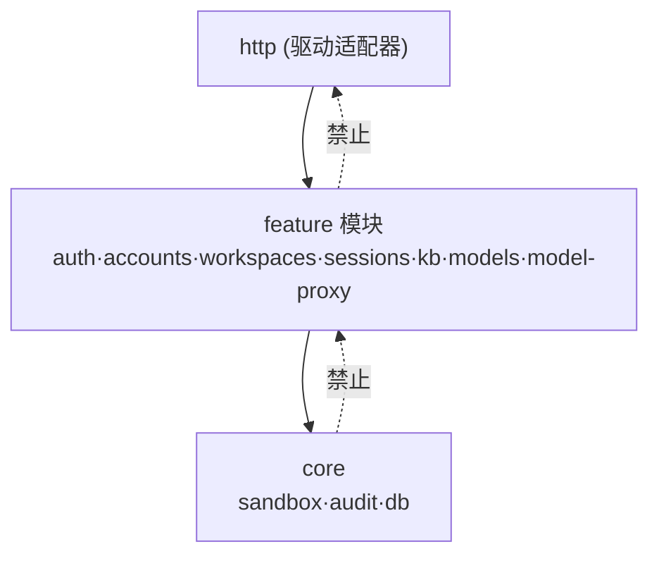
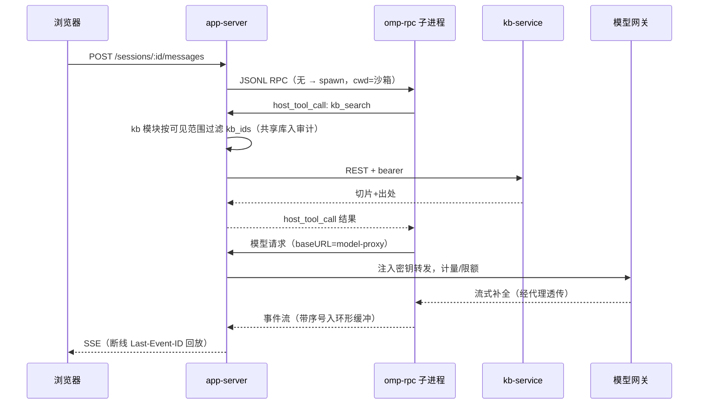

# 系统架构 — open-workbuddy

> 2026-08-29。顶层架构：模块图、依赖规则、目录结构、数据流。
> 输入：`PLAN.md`（建什么/分几步）、`CONTEXT.md`（术语与不变量）、`docs/adr/0001`–`0008`（决策）。
> 行为基准是 live demo；本文只定形状，模块内部接口细化到实现时再做。

## 1. 范围与目标

覆盖整个系统的顶层分解：app-server / web SPA / kb-service 三个自研组件的模块图与相互契约，
以及 omp 子进程、模型网关、Infinity 的接入方式。不含：模块内部详细接口、数据库 schema、
API 端点清单（属 spec 阶段）。

## 2. 约束

- 内网单机部署包（P4），无公网依赖；部署包带 fuse3 + rclone（ADR-0003）。
- omp fork 冻结 v18.0.10，只经 stdio JSONL RPC 驱动（ADR-0001）。
- omp 与 kb-service 不感知租户；多租户逻辑全在 app-server（PLAN §2 决策 3）。
- CONTEXT.md 五条不变量，尤其：凭证不进 omp 环境（不变量 4）、沙箱越界拒绝+审计（不变量 3）。
- `app-reference/` 只读参照，内容不进产物。

## 3. 模块图

### 3.1 app-server（TS/Node，模块化单体）

术语按 deep-modules：**接口** = 调用方须知的全部；**接缝背后** = 被隐藏的复杂度。

| 模块 | 接口 | 接缝背后 | 深度理由（删除测试） |
|---|---|---|---|
| `core/sandbox` | `resolve(principal, workspaceId, relPath) → 绝对路径 \| 拒绝`（拒绝自动入审计）；`deriveWhitelist(workspace) → omp 沙箱配置` | 路径规范化、symlink 逃逸防御、多根挂载点合并、白名单推导（排除 app-server 配置） | 删掉它，越界防御在 workspaces/sessions/kb 每个调用点重现——AGENTS.md 白盒关键路径 |
| `core/audit` | `emit(event)`；`query(filter, principal)` | 只追加表、账号隔离过滤 | 所有模块的合规出口收敛于一处 |
| `core/db` | SQLite 句柄 + 迁移执行 | WAL 配置、schema 迁移（ADR-0004） | |
| `auth` | `authenticate(req) → Principal`；login/callback/logout 路由 | OIDC 流程、会话 cookie、首登 provisioning；适配器×2：oidc、dev-stub（ADR-0007） | 两个适配器 = 真接缝 |
| `accounts` | 账号属性/角色/配额/项目组管理；`scopeOf(principal)` → 可见范围解析输入 | IdP 字段与应用侧字段的分界 | |
| `workspaces` | 空间 CRUD、树列举、文件读/预览、挂载 attach/detach/status | `mounts/` 子模块 = mount-manager：rclone/sshfs 进程生命周期、凭证保管、健康探测、崩溃重挂（ADR-0003）；多根树合并 | 挂载协议差异（SFTP/NFS/SMB）全部藏在接缝后 |
| `sessions` | `create/resume/fork/list`；`post(input)`；`interrupt()`；`subscribe(lastEventId) → 事件流` | omp-supervisor（每活跃会话 spawn、空闲回收、数量上限）、JSONL RPC 编解码、`host_tool_call` 分派、事件序号+环形缓冲（ADR-0006）、SQLite 会话索引（正文在所有者沙箱内 omp `.jsonl`） | omp 协议与进程治理全部不外泄；调用方只见会话语义 |
| `kb` | `search(principal, query, kbRefs) → 切片+出处`；center 管理透传 | 可见范围过滤（先过滤 kb_ids 再调 kb-service）、bearer 凭证、共享库检索审计 | host tool 与 UI 检索共用同一过滤路径 |
| `models` | 模型注册表 CRUD + 探活（对话/嵌入/重排） | 网关寻址细节 | |
| `model-proxy` | 对 omp：baseURL + 会话标识；OpenAI 兼容端点 | 注册表寻址、密钥注入、流式透传、计量/限额、审计（ADR-0008） | 不变量 4 的机械保障点 |
| `http` | Express/Fastify 路由、中间件、SSE 端点 | 纯驱动适配器层，零业务 | |

### 3.2 kb-service（Python，吸收 RAGFlow）

| 模块 | 接口 | 接缝背后 |
|---|---|---|
| `api` | REST + bearer 鉴权（每请求必验，不变量 4 配套） | FastAPI 路由 |
| `ingest` | 提交文档 → 任务状态 | deepdoc 解析（模型本地路径）、12 模板切片、任务队列 |
| `retrieval` | `search(kb_ids, query, params) → 切片+出处` | 混合检索、重排、agentic 环（改写→召回→充分性→二轮） |
| `store` | RAGFlow `DocStoreConnection` | Infinity 适配（ADR-0005），保留 ES 退路 |
| `embedding` | 内部客户端 | 直连模型网关（凭证在 kb-service 配置，合规） |

kb-service 只认 kb_id 集合，不认用户——租户过滤是 app-server `kb` 模块的职责。

### 3.3 web SPA（React + Vite）

路由镜像 demo IA：`/`、`/files`、`/center/*`（8 tab）、`/settings`。横切：`lib/api`（REST 客户端）、
`lib/sse`（Last-Event-ID 重连）、`lib/theme`（已有）。每路由一个 feature 目录，不做全局状态库，
按需 React context。

## 4. 依赖规则



1. 方向单向：`http → feature → core`。core 不 import feature，feature 不 import http。
2. feature 之间只允许显式声明的依赖：`sessions → kb`（host tool 分派）、`workspaces/sessions/kb → core/sandbox`、`kb → accounts`（可见范围）。其余一律经 core。
3. **一切文件路径操作必须经 `core/sandbox.resolve`**；feature 模块直接 `fs` 访问用户路径是缺陷。
4. omp 与 kb-service 之间无直连——KB 检索必走 `host_tool_call → app-server kb 模块` 转发。
5. 跨服务契约（app-server↔kb-service）语言中立 REST，不共享代码。

（AGENTS.md 已知盲区：模块 import 边界暂无机械检查，依赖规则靠评审；引入 dependency-cruiser 时以本节为规则源。）

## 5. 目录结构

```
server/src/
├── app.ts               # bootstrap：装配模块、起 HTTP
├── core/
│   ├── db/              # SQLite 打开 + 迁移
│   ├── audit/           # emit/query，只追加
│   └── sandbox/         # resolve、白名单推导
├── auth/                #   providers/oidc.ts、providers/dev-stub.ts
├── accounts/
├── workspaces/
│   └── mounts/          # mount-manager（rclone/sshfs 生命周期）
├── sessions/
│   ├── omp/             # supervisor + JSONL RPC 编解码
│   └── stream/          # 事件序号、环形缓冲、SSE 回放
├── kb/                  # 可见范围过滤 + kb-service 客户端
├── models/              # 注册表 + 探活
├── model-proxy/
└── http/                # 路由、中间件、SSE 端点

kbservice/src/kbservice/
├── api/                 # FastAPI + bearer 中间件
├── ingest/              # deepdoc + 模板切片 + 任务队列
├── retrieval/           # 混合检索 + agentic 环
├── store/               # DocStoreConnection → Infinity
└── embedding/           # 模型网关客户端

web/src/
├── routes/              # /、/files、/center/*、/settings
├── features/            # 每页面一个目录
└── lib/                 # api、sse、theme
```

每模块经入口文件（`index.ts`）暴露接口，实现藏在子目录——TS 深模块布局。

## 6. 数据流

### 6.1 一轮会话（含 KB 检索与模型调用）



### 6.2 其余流（一行一条）

- **登录**：浏览器 → OIDC IdP → callback → auth 建 Principal，首登 provisioning 账号与沙箱根目录。
- **挂载**：UI 填凭证 → mounts 起 rclone/sshfs 挂到沙箱内挂载点 → sandbox 白名单更新 → 在线状态探测。
- **摄取**：UI 上传（文档落所有者沙箱）→ kb-service ingest 解析/切片/嵌入（嵌入直连网关）→ Infinity。
- **审计**：sandbox 拒绝、共享 KB 检索、账号操作、model-proxy 计量 → `core/audit` 追加表 → center 审计页查询。

## 7. 决策索引

| ADR | 决策 |
|---|---|
| [0001](../adr/0001-omp-frozen-fork-subprocess-rpc.md) | omp 冻结 fork，每活跃会话子进程 RPC |
| [0002](../adr/0002-absorb-ragflow-into-kb-service.md) | 吸收 RAGFlow 组装 kb-service |
| [0003](../adr/0003-fuse-per-workspace-mounts.md) | FUSE 每空间挂载 |
| [0004](../adr/0004-sqlite-wal-metadata-store.md) | SQLite WAL 元数据存储 |
| [0005](../adr/0005-infinity-doc-store.md) | Infinity 文档存储 |
| [0006](../adr/0006-rest-sse-event-replay.md) | REST + SSE，事件序号回放 |
| [0007](../adr/0007-oidc-provider-seam.md) | OIDC provider 接缝 |
| [0008](../adr/0008-model-proxy-credentials.md) | app-server 模型代理，omp 零凭证 |

## 8. 开放问题

- **IdP 是否带组声明**：带则项目组改同步（ADR-0007 的开放尾巴）。解锁条件 = 身份源调研结论；P3 前必须关闭。
- **omp 子进程池参数**（上限/内存限额/空闲回收）：P1 实测定参（PLAN §5）。
- **deepdoc 模型内网分发清单**：方案已定捆包（backend-research §3），具体模型清单与体积 P2 落地时定。
- **omp 子进程与 app-server 的 uid 分离**：是否每账号独立 uid 运行 omp（进程级可见性与资源限额的根手段）。P1 沙箱强制落地前定；未分离期间 ADR-0003/0008 的"凭证不上命令行/不可猜测 token"是唯一防线。
- **模块 import 边界机械化**：dependency-cruiser 接入时机（AGENTS.md 已知盲区之一）。
