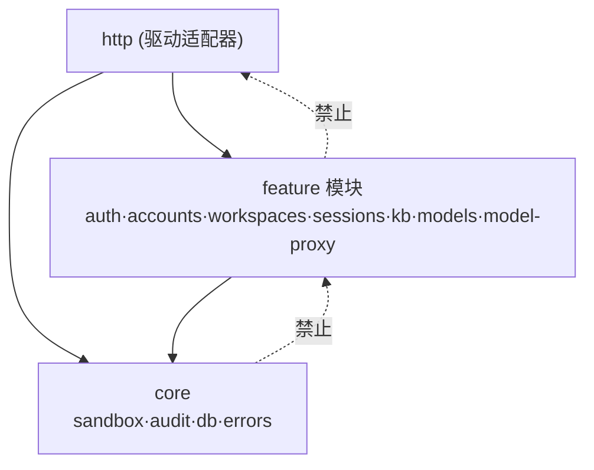
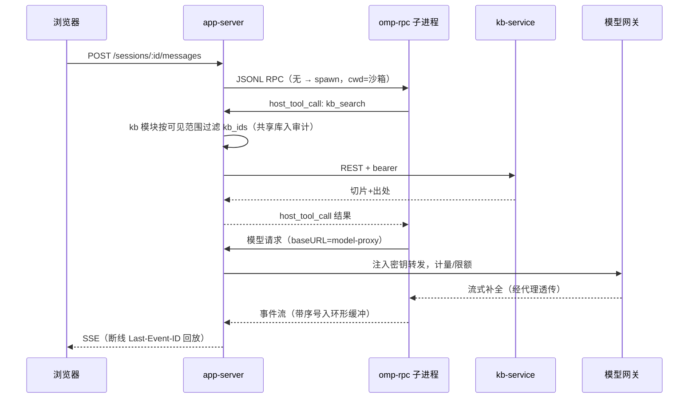

# 系统架构 — open-workbuddy

> 2026-08-29。顶层架构：模块图、依赖规则、目录结构、数据流。
> 输入：`PLAN.md`（建什么/分几步）、`CONTEXT.md`（术语与不变量）、`docs/adr/0001`–`0008`（决策）。
> 行为基准是 live demo；本文只定形状，模块内部接口细化到实现时再做。

## 1. 范围与目标

覆盖整个系统的顶层分解：app-server / web SPA / kb-service 三个自研组件的模块图与相互契约，
以及 omp 子进程、模型网关、Infinity 的接入方式。不含：模块内部详细接口、数据库 schema、
API 端点清单（属 spec 阶段）。

## 2. 约束

- 内网单机部署包（P4），无公网依赖；部署包带 fuse3 + rclone（ADR-0003）。
- omp fork 冻结 v18.0.10，只经 stdio JSONL RPC 驱动（ADR-0001）。
- omp 与 kb-service 不感知租户；多租户逻辑全在 app-server（PLAN §2 决策 3）。
- CONTEXT.md 五条不变量，尤其：凭证不进 omp 环境（不变量 4）、沙箱越界拒绝+审计（不变量 3）。
- `app-reference/` 只读参照，内容不进产物。

## 3. 模块图

### 3.1 app-server（TS/Node，模块化单体）

术语按 deep-modules：**接口** = 调用方须知的全部；**接缝背后** = 被隐藏的复杂度。

| 模块 | 接口 | 接缝背后 | 深度理由（删除测试） |
|---|---|---|---|
| `core/sandbox` | `createSandbox({rootOf, audit}) → { resolve(principal, workspaceId, relPath, op: "read"\|"list"\|"mkdir") → 绝对路径 \| 拒绝, ensureSharedDir }`（`rootOf` 由 workspaces 实现：返回 null → `not_found` 且不审计；越界先经 `core/audit` 记 `sandbox.reject` 再抛 `sandbox_denied`）；`deriveWhitelist(workspace) → omp 沙箱配置`（S1b 未来项，未实现） | 路径规范化、symlink 逃逸防御；多根挂载点合并、白名单推导（排除 app-server 配置）为 S1b 未来项 | 删掉它，越界防御在 workspaces/sessions/kb 每个调用点重现——AGENTS.md 白盒关键路径 |
| `core/audit` | `emit(db, event)`；`query(db, principal, {limit?, before?})` | 只追加表、账号隔离、canonical id 游标分页 | 所有模块的合规出口收敛于一处 |
| `core/errors` | `HttpError`、十六码与中文消息（含 `sandbox_denied`/`conflict`/`preview_too_large`/`preview_unsupported`） | HTTP 状态码、content-parser 归属与信封映射仍在 `http/` | 一处运行时身份，避免 core 反向依赖 http |
| `core/db` | SQLite 句柄 + 迁移执行 | WAL 配置、schema 迁移（ADR-0004） | |
| `auth` | `authenticate(req) → Principal`；login/callback/logout 路由 | OIDC 流程、会话 cookie、首登 provisioning；适配器×2：oidc、dev-stub（ADR-0007） | 两个适配器 = 真接缝 |
| `accounts` | 账号属性/角色/配额/项目组管理；`scopeOf(principal)` → 可见范围解析输入 | IdP 字段与应用侧字段的分界 | |
| `workspaces` | 空间 CRUD、树列举、文件读/预览、挂载 attach/detach/status | `mounts/` 子模块 = mount-manager：rclone/sshfs 进程生命周期、凭证保管、健康探测、崩溃重挂（ADR-0003）；多根树合并；S1f change C（`s1f-session-list-temp-space`）：临时空间（`workspaces.temporary` 标记，目录名 `tmp-<id>`；随会话在同一事务里创建，`GET /api/workspaces` 不列出、按 id 的端点照常可达）、`POST /api/workspaces/:id/promote`（原地转正：只改名字与标记，目录不动，`workspace.promote` 审计）、`temp-dir-remove.ts`（临时空间目录经 app 私有 trash 中转删除，`EXDEV` 时原地删）、`snapshots.ts`（回合快照的落盘 `take` 与两种目录删除）与 `snapshots-restore.ts`（还原）——快照根目录由 `createApp` 注入，这两个模块不导入 `sessions/`，也没有自己的路由（部署侧见 §9.1） | 挂载协议差异（SFTP/NFS/SMB）全部藏在接缝后 |
| `sessions` | `create/resume/fork/list`；`post(input)`；`interrupt()`；`subscribe(lastEventId) → 事件流` | omp-supervisor（每活跃会话 spawn、空闲回收、全局上限 `OMP_MAX_PROCESSES`（默认 16）/ 触顶驱逐最久空闲进程（无可驱逐 → `agent_capacity`）、并发 spawn 上限 `OMP_SPAWN_CONCURRENCY`（缺省 CPU 数；准入后 FIFO 排队、排队不计入握手 deadline，握手超时写一行 stderr 记录；保留的基础设施故障与会话删除清理失败各写一行 `{"event":"session_fault"}`）、审批经 host 应答（`approval.request`/`approval.resolved`，`chat_approvals` 持久化））、JSONL RPC 编解码、`host_tool_call` 分派、事件序号+环形缓冲（ADR-0006）、SQLite 会话/消息/步骤存储（持久历史事实源；实时缺口恢复使用 store 自有待刷尾部补齐的完整快照及同刻 streamCursor，读取不改变刷盘策略——#214）；omp `.jsonl` 存于 app-server 托管的 `OMP_STATE_DIR`、只供 `--resume`（S0b grill 2026-09-18）；S1c change B：会话可绑定工作空间（绑定会话的 omp cwd 为该空间根，`session.bind` 审计）、元数据 `PATCH /api/sessions/:id`（标题 / 场景 / 置顶）与 `DELETE /api/sessions/:id`（`session.delete` 审计）、`thinking.delta` 与 `files.changed` 事件（分别持久化到 `chat_messages.thinking` 与 `chat_steps.changes`）、`MODEL_REASONING`（托管 `models.yml` 的模型条目是否声明 reasoning；只影响 omp 的请求侧，不门控宿主对 thinking 的解析）、slash 白名单与 `GET /api/commands`（白名单外以 `/` 开头的文本转义后送模型）；S1f：任务清单（omp `todo` 工具结果的全量清单归一化后持久化到 `chat_sessions.todo`，经 `todo.updated` 事件与消息快照顶层 `todo` 下发；结构不合规的候选丢弃并写一行不含任务文本的 stderr warn 记录）；S1f change C（`s1f-session-list-temp-space`）：会话视图十一键（增 `archivedAt`、`pendingApproval`、`temporaryWorkspace`，`store-view.ts`）；`PATCH /api/sessions/:id` 增 `archived` 键，已归档会话的 prompt / 重新生成 / fork / 撤回以 409 `session_archived` 拒绝；不带 `workspaceId` 的 `POST /api/sessions` 同事务创建临时空间，`DELETE /api/sessions/:id` 在它是最后一个使用者时连同临时空间的行、目录与快照一起删（`workspace.delete` 审计）；列表事件连接 `GET /api/sessions/events`（`list-events.ts`：按账号的通知器与 SSE 路由，只发 `sessions.changed` 与 `session.rewound`，无序号、无回放，见 §9.2）；受理 prompt 后、派发前的回合快照步骤（`turn-snapshot.ts`，经 `supervisor.prompt` 的 `beforeDispatch`；登记表 `chat_turn_snapshots` 只由 `store-undo.ts` 读写）；撤回 `POST /api/sessions/:id/undo`（`undo.ts`：body `{messageId, files}`，`files` 为 `keep` / `restore` / `force`；临时进程上 `branch` 后原地回退对话并可还原文件，冲突为 409 `undo_conflict`，`session.undo` 审计；与 fork 共用 `branch-temp.ts` 的对位与临时进程）；消息视图与 prompt 202 增 `undo` 键 | omp 协议与进程治理全部不外泄；调用方只见会话语义 |
| `kb` | `search(principal, query, kbRefs) → 切片+出处`；center 管理透传 | 可见范围过滤（先过滤 kb_ids 再调 kb-service）、bearer 凭证、共享库检索审计 | host tool 与 UI 检索共用同一过滤路径 |
| `models` | 模型注册表 CRUD + 探活（对话/嵌入/重排） | 网关寻址细节 | |
| `model-proxy` | 对 omp：baseURL + 会话标识；OpenAI 兼容端点 | 注册表寻址、密钥注入、流式透传、计量/限额、审计（ADR-0008） | 不变量 4 的机械保障点 |
| `http` | Fastify 路由、中间件、SSE 端点；状态码与错误信封映射 | 纯驱动适配器层，零业务 | |

### 3.2 kb-service（Python，吸收 RAGFlow）

| 模块 | 接口 | 接缝背后 |
|---|---|---|
| `api` | REST + bearer 鉴权（每请求必验，不变量 4 配套） | FastAPI 路由 |
| `ingest` | 提交文档 → 任务状态 | deepdoc 解析（模型本地路径）、12 模板切片、任务队列 |
| `retrieval` | `search(kb_ids, query, params) → 切片+出处` | 混合检索、重排、agentic 环（改写→召回→充分性→二轮） |
| `store` | RAGFlow `DocStoreConnection` | Infinity 适配（ADR-0005），保留 ES 退路 |
| `embedding` | 内部客户端 | 直连模型网关（凭证在 kb-service 配置，合规） |

kb-service 只认 kb_id 集合，不认用户——租户过滤是 app-server `kb` 模块的职责。

### 3.3 web SPA（React + Vite）

路由镜像 demo IA：`/`、`/files`、`/center`（扁平路由，8 tab 为页内状态，S1d 需深链时再引入 query 参数）、`/settings`。横切：`lib/api`（REST 客户端）、
`lib/sse`（Last-Event-ID 重连）、`lib/theme`（已有）、`lib/session-list-events`（列表事件连接 `GET /api/sessions/events` 的连接器，S1f change C）。每路由一个 feature 目录，不做全局状态库，
按需 React context。

`web/src/ui` 是基元层：按钮、输入、开关、标签、chip、Dialog、ConfirmDialog、Drawer、Menu、Popover、
Toast、Tooltip、空态、分段控件、图标和品牌 mark。交互行为依赖 Radix Primitives
（Dialog/DropdownMenu/Popover/RadioGroup/Switch/Toast/Tooltip），图标取自 lucide-react。
token 定义在 `web/src/styles/tokens.css`（调色板 + 语义层，亮/暗两套），动效定义在
`ui/motion.css`（受 `prefers-reduced-motion` 控制），二者都归这一层。feature 只经 `ui/index.ts`
使用基元，不直接依赖 Radix；demo 中没有后端契约的控件不渲染。

## 4. 依赖规则


```mermaid
flowchart TD
    H["http (驱动适配器)"] --> F["feature 模块<br/>auth·accounts·workspaces·sessions·kb·models·model-proxy"]
    H --> C["core<br/>sandbox·audit·db·errors"]
    F --> C["core<br/>sandbox·audit·db·errors"]
    F -.禁止.-> H
    C -.禁止.-> F
```

1. 方向单向：`http → feature → core`。http 可直接依赖 core（共享错误身份）；core 不 import feature/http，feature 不 import http。
2. feature 之间只允许显式声明的依赖：`sessions → kb`（host tool 分派）、`sessions → workspaces`（仅 `sessions/session-delete.ts` 导入 `workspaces/temp-dir-remove.ts` 的目录删除；快照服务经 `app.ts` 注入，不直接导入）、`workspaces/sessions/kb → core/sandbox`、`kb → accounts`（可见范围）。其余一律经 core。
3. **一切文件路径操作必须经 `core/sandbox.resolve`**；feature 模块直接 `fs` 访问用户路径是缺陷。
4. omp 与 kb-service 之间无直连——KB 检索必走 `host_tool_call → app-server kb 模块` 转发。
5. 跨服务契约（app-server↔kb-service）语言中立 REST，不共享代码。

（AGENTS.md 已知盲区：模块 import 边界暂无机械检查，依赖规则靠评审；引入 dependency-cruiser 时以本节为规则源。）

## 5. 目录结构

```
server/src/
├── app.ts               # 可注入装配：auth → http guard → model-proxy → sessions；不 listen/关 DB
├── server.ts            # 唯一生产入口：配置 → DB → app → listen；持有 DB 生命周期
├── agent-config.ts      # app/入口共用的纯 agent 配置与默认值，无环境读取或 IO
├── core/
│   ├── db/              # SQLite 打开 + 迁移
│   ├── audit/           # emit/query，只追加
│   ├── errors/          # 共享 HttpError、codes、messages
│   └── sandbox/         # resolve、白名单推导
├── auth/                #   providers/oidc.ts、providers/dev-stub.ts
├── accounts/
├── workspaces/
│   ├── snapshots.ts          # 回合快照落盘（take）与快照目录删除
│   ├── snapshots-restore.ts  # 按快照清单还原工作空间
│   ├── temp-dir-remove.ts    # 临时空间目录经 trash 删除
│   └── mounts/               # mount-manager（rclone/sshfs 生命周期）
├── sessions/
│   ├── supervisor.ts    # runtime、事件映射与持久化编排
│   ├── index.ts         # 会话模块注册、对账与资源回收
│   ├── list-events.ts   # 列表事件通知器与 GET /api/sessions/events
│   ├── store-view.ts    # 会话视图（十一键）的列集与映射
│   ├── turn-snapshot.ts # 受理 prompt 后、派发前的快照步骤
│   ├── store-undo.ts    # 快照登记行读写、冲突判定、撤回事务
│   ├── undo.ts          # 撤回编排与 POST /api/sessions/:id/undo
│   ├── branch-temp.ts   # fork 与撤回共用的对位、branch 与临时进程
│   ├── omp/             # 子进程生命周期 + JSONL RPC 编解码
│   └── stream/          # 事件序号、环形缓冲、SSE 回放
├── kb/                  # 可见范围过滤 + kb-service 客户端
├── models/              # 注册表 + 探活
├── model-proxy/
└── http/                # 路由、中间件、SSE 端点

kbservice/src/kbservice/
├── api/                 # FastAPI + bearer 中间件
├── ingest/              # deepdoc + 模板切片 + 任务队列
├── retrieval/           # 混合检索 + agentic 环
├── store/               # DocStoreConnection → Infinity
└── embedding/           # 模型网关客户端

web/src/
├── routes/              # /、/files、/center、/settings
├── features/            # 每页面一个目录
└── lib/                 # api、sse、theme
```

每模块经入口文件（`index.ts`）暴露接口，实现藏在子目录——TS 深模块布局。

## 6. 数据流

### 6.1 一轮会话（含 KB 检索与模型调用）


```mermaid
sequenceDiagram
    participant B as 浏览器
    participant S as app-server
    participant O as omp-rpc 子进程
    participant K as kb-service
    participant G as 模型网关
    B->>S: POST /sessions/:id/messages
    S->>O: JSONL RPC（无 → spawn，cwd=沙箱）
    O->>S: host_tool_call: kb_search
    S->>S: kb 模块按可见范围过滤 kb_ids（共享库入审计）
    S->>K: REST + bearer
    K-->>S: 切片+出处
    S-->>O: host_tool_call 结果
    O->>S: 模型请求（baseURL=model-proxy）
    S->>G: 注入密钥转发，计量/限额
    G-->>O: 流式补全（经代理透传）
    O-->>S: 事件流（带序号入环形缓冲）
    S-->>B: SSE（断线 Last-Event-ID 回放）
```

S0b 实际流入口为 `GET /api/sessions/:id/events`（#103）：cookie/owner 校验后才发 SSE 头；Supervisor 同步登记订阅并读取当前 generation 的唯一 ring，回放之后接实时事件。传输只保留最多1000条的初始回放引用，不累积实时队列：回放背压等待 `drain`；暂停期间到达实时事件或实时写入背压则结束该客户端，由重连补齐。15s heartbeat 不占序号。`preClose` 销毁活跃、暂停及尚未完成 end 的响应，再走既有 supervisor→store→DB 关停；晚到的已认证 owner 请求以既有 `agent_unavailable`（502）和 `Connection: close` 拒绝。浏览器消费/快照安装仍由 #92/#93/#104 交付。

### 6.2 其余流（一行一条）

- **登录**：浏览器 → OIDC IdP → callback → auth 建 Principal，首登 provisioning 账号与沙箱根目录。
- **挂载**：UI 填凭证 → mounts 起 rclone/sshfs 挂到沙箱内挂载点 → sandbox 白名单更新 → 在线状态探测。
- **摄取**：UI 上传（文档落所有者沙箱）→ kb-service ingest 解析/切片/嵌入（嵌入直连网关）→ Infinity。
- **审计**：sandbox 拒绝、共享 KB 检索、账号操作、model-proxy 计量 → `core/audit` 追加表 → center 审计页查询。

## 7. 决策索引

| ADR | 决策 |
|---|---|
| [0001](../adr/0001-omp-frozen-fork-subprocess-rpc.md) | omp 冻结 fork，每活跃会话子进程 RPC |
| [0002](../adr/0002-absorb-ragflow-into-kb-service.md) | 吸收 RAGFlow 组装 kb-service |
| [0003](../adr/0003-fuse-per-workspace-mounts.md) | FUSE 每空间挂载 |
| [0004](../adr/0004-sqlite-wal-metadata-store.md) | SQLite WAL 元数据存储 |
| [0005](../adr/0005-infinity-doc-store.md) | Infinity 文档存储 |
| [0006](../adr/0006-rest-sse-event-replay.md) | REST + SSE，事件序号回放 |
| [0007](../adr/0007-oidc-provider-seam.md) | OIDC provider 接缝 |
| [0008](../adr/0008-model-proxy-credentials.md) | app-server 模型代理，omp 零凭证 |
| [0010](../adr/0010-dedicated-omp-uid.md) | omp 子进程单一专用 uid，与 app-server 分离 |
| [0011](../adr/0011-sandbox-paths-not-browser-secret.md) | 绝对沙箱路径不属于对浏览器保密的信息（界面仍以逻辑路径展示） |

## 8. 开放问题

- **IdP 是否带组声明**：带则项目组改同步（ADR-0007 的开放尾巴）。解锁条件 = 身份源调研结论；P3 前必须关闭。
- **omp 子进程池参数**（上限/内存限额/空闲回收）：P1 实测定参（PLAN §5）。
- **deepdoc 模型内网分发清单**：方案已定捆包（backend-research §3），具体模型清单与体积 P2 落地时定。
- ~~omp 子进程与 app-server 的 uid 分离~~ 已关闭（2026-09-18，ADR-0010：单一专用 omp uid；每账号 uid 记为 S3b/S4b 升级路径）。
- **模块 import 边界机械化**：dependency-cruiser 接入时机（AGENTS.md 已知盲区之一）。

## 9. 部署与运维说明

### 9.1 回合快照（S1f，change `s1f-session-list-temp-space`）

绑定了工作空间的会话每受理一条用户消息，宿主在派发前把该空间做一份快照，撤回时据此还原文件（命令回合不做，重新生成沿用原消息的那一份）。布局、权限位、清理触发点与残余的权威是 [ADR-0010](../adr/0010-dedicated-omp-uid.md) 的「补充（2026-10-08，#976）」，这里只写部署要知道的。

**配置**（`server/src/agent-config.ts`；四项都可选）：

| 环境变量 | 默认 | 单位 | 含义 |
|---|---|---|---|
| `SNAPSHOT_MAX_FILE_BYTES` | `20971520`（20 MiB） | 字节 | 单个文件的上限 |
| `SNAPSHOT_MAX_TOTAL_BYTES` | `524288000`（500 MiB） | 字节 | 一份快照里文件大小之和的上限（未变文件也计入，即空间本身的大小） |
| `SNAPSHOT_MAX_ENTRIES` | `50000` | 条目数（文件、目录、符号链接） | 一份快照的条目数上限 |
| `SNAPSHOT_EXCLUDE_NAMES` | `node_modules,.venv,__pycache__` | 逗号分隔的目录名 | 任何层级上叫这些名字的目录整棵不进快照 |

- 三个数值：规范十进制正整数（无前导零），范围 `1..2147483647`——总量上限因此调不过约 2 GiB。恰等于上限不算超限。
- `SNAPSHOT_EXCLUDE_NAMES`：设置即**整份替换**默认名单（不是追加）；不去空格、不去重；空字符串表示不排除任何目录；名字不能为空、`.`、`..`，不能含 `/` 或 NUL。
- 任一项非法，服务启动失败。
- 触到上限时，回合本身照常执行，差别在撤回：
  - 超过单文件上限的文件不进快照，其余照常；该消息仍可撤回，这个文件保持回合之后的样子并列在未还原文件里。
  - 超过总量或条目上限，这一轮没有快照（登记为 `too_large`）：该消息**不能撤回**，对话与文件都不回退，撤回按钮给出原因 `这一轮开始前工作空间超出快照上限，无法撤回`。

**`.git` 进快照**：默认名单只排除依赖目录，版本库目录与普通目录一样进快照、受同样三个上限约束，撤回时连同回合里产生的提交、引用与暂存区一起还原。代价是带大仓库的空间更容易触到上限：每个松散对象算一个条目，历史长的仓库容易超过条目或总量上限（整轮不可撤回）；超过单文件上限的 pack 文件不进快照，撤回时保持现状。两种调法：

- 调大上限。代价是磁盘占用，以及空间的第一份快照是整树复制、耗时加在 prompt 的 202 之前。
- 把 `.git` 加回排除名单：`SNAPSHOT_EXCLUDE_NAMES=node_modules,.venv,__pycache__,.git`。此后撤回只还原工作树，`.git` 保持现状——回合里做的提交不随撤回还原。

**磁盘规划**：

- 位置：`<OMP_STATE_DIR>/snapshots/<workspaceId>/<messageId>/`（`OMP_STATE_DIR` 默认是仓库下的 `var/omp-state`），`0700`、app 用户私有。给状态目录所在的文件系统留出这部分空间。
- 大小：未变的文件是与同一空间上一份成功快照（不分会话）之间的硬链接，变过的文件整份复制（不用写时复制）。一个空间的占用约等于「第一份的整树」加「之后各回合之间变过的文件之和」；每份至多 `SNAPSHOT_MAX_TOTAL_BYTES`。
- 没有按时间或容量的淘汰，启动时也不扫描：快照留到它的消息被删为止（撤回、删除会话、临时空间随最后一个会话删除、受理被补偿）。归档不清理。要腾空间只有删会话或撤回。

**没有登记行的快照目录**：进程在快照写出到登记行落库之间被杀，或清理失败时，会留下没有登记行的目录（半份或完整），宿主不回收（来源见 ADR-0010）。临时空间下的随该空间删除整目录清掉；正式空间下的只能手工删。步骤：

1. 停掉 app-server。运行中刚建出、登记行尚未写入的目录与残留的分不开，所以不能在线做。
2. 用任意 SQLite 客户端读 `DB_PATH`（默认是仓库下的 `var/dev.db`）：

   ```sql
   SELECT id FROM workspaces;
   SELECT workspace_id, message_id FROM chat_turn_snapshots WHERE outcome = 'ok';
   ```

3. 以 app 用户身份（目录是 `0700`）对照 `<OMP_STATE_DIR>/snapshots`：名字不在第一条结果里的 `<workspaceId>` 目录，整个删除；其余 `<workspaceId>` 目录下，`(workspaceId, messageId)` 不在第二条结果里的 `<messageId>` 目录，删除。直接递归删除即可——与相邻快照共享的文件靠链接计数保留，别的快照不受影响。
4. 有 `ok` 登记行的目录不要删：删掉后该消息连文件一起的撤回会失败。空的 `<workspaceId>` 目录无害，可留。

**回滚**：迁移 037–039 只增列与表、不回退，旧版本忽略它们；但旧版本会把临时空间列在 `GET /api/workspaces` 里，也不清理临时空间目录与快照目录。回滚后可手工删除的只有 `<OMP_STATE_DIR>/snapshots`（停服务后整个删除）。账号根下的 `tmp-<32 位十六进制>` 目录仍被 `workspaces` 行引用、装着用户文件，不要删。

### 9.2 列表事件连接与 HTTP/1.1 连接数

会话页挂载期间，每个标签页保持一条列表事件 SSE（`GET /api/sessions/events`，只发通知）；选中会话时另有该会话的事件流（`GET /api/sessions/:id/events`）——一个选中了会话的标签页占 2 条长连接。HTTP/1.1 下浏览器对同一个源约 6 条连接，同一浏览器开到第 4 个这样的标签页起，对该源的请求会排队（表现为页面卡住不响应）。app-server 自身只提供 HTTP/1.1；需要更多标签页时在前置的反向代理上启用 HTTP/2（多路复用，不受此限）。这是部署事项，本仓库不配置。

### 9.3 输入框能力（S1g，change `s1g-composer-capabilities`）

输入框上的权限档位、模型与推理强度、附件上传各带来几项部署事项。档位的决策与残余的权威是 [ADR-0012](../adr/0012-omp-project-config-host-overlay.md) 的「补充（S1g）：审批档位按会话取值」，模型代理与凭证是 [ADR-0008](../adr/0008-model-proxy-credentials.md)，这里只写部署要知道的。

**配置**（`server/src/agent-config.ts` 与 `server/src/model-catalog.ts`；四项都可选）：

| 环境变量 | 默认 | 单位 | 含义 |
|---|---|---|---|
| `APPROVAL_MAX_MODE` | `yolo`（三档都开放） | `always-ask`、`write`、`yolo` 之一 | 所有会话可用权限档位的上界 |
| `UPLOAD_MAX_BYTES` | `524288000`（500 MiB） | 字节 | 单个上传文件的上限；恰等于上限的文件被接受 |
| `UPLOAD_MAX_FILES` | `10` | 个 | 一条消息可带的附件个数上限；超过时发送消息的请求得到 400 |
| `MODEL_CATALOG` | 未设置（白名单只有 `MODEL_ID` 一个模型） | JSON 数组 | 模型白名单，格式见下 |

- `APPROVAL_MAX_MODE`：要与三个取值之一逐字符相同，不去空格、不改大小写。
- 两个数值：规范十进制正整数（无前导零），范围 `1..2147483647`——单文件上限因此调不过约 2 GiB。
- 任一项非法，服务启动失败：退出码 1，标准错误只有一行 `{"event":"server_start_failed","reason":"config"}`，不指出是哪一项、也不回显取值，需自行逐项核对。
- 界面经 `GET /api/composer/options` 取可选档位、模型清单、两个上传上限与该账号的缺省值；取到一次后，页面打开期间不再重取。改配置要重启服务，已打开的页面要刷新。

**`MODEL_CATALOG`**：

- 1 到 32 个对象的 JSON 数组；每个对象只接受 `id`、`name`、`reasoning`、`vision`、`efforts` 五个键。
- `id` 是发给上游的模型名：1 到 128 个 UTF-8 字节、无控制字符、不重复。`name` 是界面显示名：1 到 64 个码点、无控制字符，缺省等于 `id`（省略 `name` 时 `id` 也得满足这一条）。`reasoning`（是否支持推理）、`vision`（是否接受图片输入）是布尔，缺省 `false`。
- `reasoning: true` 的元素必须写 `efforts`，其余元素不得写；`efforts` 是 `minimal`、`low`、`medium`、`high`、`xhigh`、`max` 的非空子集，按此次序升序书写，不写 `off`。
- 界面可选的强度是 `off` 加所声明的各档。缺省强度：声明了 `high` 取 `high`，否则取低于 `high` 的最高一档，再否则取声明的第一档。

示例（占位的模型名；地址与密钥不在这一项里）：

```sh
MODEL_CATALOG='[{"id":"model-a","name":"通用","reasoning":true,"efforts":["low","medium","high"]},{"id":"model-b","name":"快速"}]'
```

与 `MODEL_ID` / `MODEL_REASONING` 的关系：

- 未设置 `MODEL_CATALOG`：白名单只有 `MODEL_ID` 一项（缺省 `deepseek-v4.1-flash`），是否支持推理取 `MODEL_REASONING`（恰为 `on` 或 `off`，缺省 `on`）。这一项不带 `efforts`，界面列出 `off` 加全部六档，而 omp 按模型 id 自定强度集合并静默夹取——界面显示的强度可能与实际使用的不同。要两者一致，就配置 `MODEL_CATALOG` 并写明 `efforts`。
- 设置了 `MODEL_CATALOG`：同时设置 `MODEL_REASONING` 则启动失败；`MODEL_ID` 未设置时数组第一项是缺省模型，设置了就必须等于某一项的 `id`，否则启动失败。
- 所有模型共用同一个上游（`MODEL_UPSTREAM_BASE_URL` / `MODEL_UPSTREAM_API_KEY`）。
- 从清单里拿掉一个模型后，存着它的会话与账号的最近选择在读取时回落到缺省模型，不需要改库。
- 创建与修改会话时，强度只校验是七个名字之一且所得模型支持推理，不校验是否在该模型的 `efforts` 之内；集合外的值原样交给 omp 夹取。

**模型代理白名单**：

- 白名单就是 `MODEL_CATALOG` 各项的 `id`（未设置时恰为 `MODEL_ID` 一项）。会话设置的校验与界面的模型清单、托管的 `models.yml`、模型代理三处用同一份。
- `POST /v1/chat/completions` 的请求体顶层必须恰有一个 `model` 成员，其值是白名单里某个 `id` 的字符串；缺少、重复、不是字符串或不在白名单内，一律 400 `bad_request`，不到达上游，响应不回显模型名。
- 这项校验排在认证与上游是否配置之后：没有有效令牌的请求先得到 401，没配上游的先得到 502。
- 要让某个模型可用：把它写进 `MODEL_CATALOG` 并重启。白名单是接入了哪些模型的清单，不是费用边界（[ADR-0008](../adr/0008-model-proxy-credentials.md)）。

**全部自动（`yolo`）**：

- 档位按会话取值，三档：`每次都问`（`always-ask`，写文件与执行命令前都确认）、`只问命令`（`write`，缺省；执行命令前确认，写文件不用）、`全部自动`（`yolo`，不经确认执行命令与修改文件）。
- `全部自动` 下助手执行命令不再等人确认。它能触及的范围仍以 omp 进程的系统用户为界（[ADR-0010](../adr/0010-dedicated-omp-uid.md)）；未设置 `OMP_USER` 时 omp 由 app-server 直接启动、与它同一个系统用户，没有这层隔离——生产部署开放这一档之前先配好 `OMP_USER`。
- 另两档也不是硬闸：确认卡 60 秒无人作答即自动允许，三档相同。反过来，`全部自动` 下 omp 若因工具自带的策略仍请求确认，照常出确认卡。
- 在界面上选 `全部自动` 要确认一次。选中后它记为该账号的最近选择：此后这个账号新建会话，创建请求没有指明档位就沿用它，不再弹确认，警示色仍在。
- 让一个账号回到别的档位：在它的某个会话里改选另一档——这同时改写最近选择；点当前已选中的那一档不发请求，什么都不改。欢迎页上选的档位随第一条消息的创建请求提交，同样改写最近选择。要对所有账号生效，用下面的封顶。
- 修改档位从该会话的下一条消息起生效（届时重启该会话的 omp 进程）；在途回合与已弹出的确认卡用旧档位。
- 审计：会话的有效档位每次变化写一条 `session.permission`（`from` / `to`）；以不同于缺省的有效档位创建的会话也写一条（`from` 为 `null`）。
- 关掉它：设 `APPROVAL_MAX_MODE=write` 并重启。此后界面不再列出 `全部自动`，请求这一档的创建与修改得到 400；已存的 `全部自动`（会话上的与账号最近选择里的）在读取时按 `write` 生效，不改库——日后把上界放回 `yolo`，这些存着的值原样恢复生效。设为 `always-ask` 时，缺省的 `write` 同样被压到 `always-ask`。

**上传与反向代理**（`POST /api/workspaces/:id/uploads?name=<文件名>`）：

- 一次请求一个文件，请求体是原始字节流（`Content-Type: application/octet-stream`，不是 multipart）。边收边写盘，不整份进内存，不受框架的请求体上限约束。
- 超限有两种时机：声明的 `Content-Length` 超过 `UPLOAD_MAX_BYTES` 时不读请求体直接 413；否则读到越界的那一块时 413 并停止读取。两者都写一条 `upload.reject` 审计。
- 这条路由上失败的响应都带 `Connection: close`，服务端随后关闭连接。
- app-server 没有设请求超时与连接空闲超时（`requestTimeout`、`connectionTimeout` 都是 0），停住的上传连接它不会主动断；要靠前置代理的超时来断，按可接受的最慢上传设。
- 前置反向代理要做两件事：把这条路由的请求体上限放到不小于 `UPLOAD_MAX_BYTES`，并关闭请求缓冲——否则代理先把整个文件收完再转发，进度失真，代理的磁盘被占。

nginx 的示例（只是这一条路由的片段；指令的含义以 nginx 文档为准，数值按自己的上限与网络情况改）：

```nginx
location ~ ^/api/workspaces/[^/]+/uploads$ {
    client_max_body_size 500m;   # 不小于 UPLOAD_MAX_BYTES；500m 对应缺省的 524288000
    proxy_request_buffering off;
    proxy_http_version 1.1;
    client_body_timeout 300s;
    proxy_send_timeout 300s;
    proxy_read_timeout 300s;
    proxy_pass http://<app-server 监听地址>;
}
```

HTTP/2 的建议见 9.2。

**上传残留**：

- 文件落在所属工作空间（正式或临时）根下的 `uploads/`，都在 `SANDBOX_ROOT`（默认是仓库下的 `var/sandbox`）之下。重名不覆盖，自动编号为 `名字 (1).扩展名` … `(999)`；全被占用时 409。
- 没有配额，也没有清理：`UPLOAD_MAX_BYTES` 只限单个文件，`UPLOAD_MAX_FILES` 只限一条消息引用的附件个数，上传的次数与总量不设限。自行给沙箱根所在的文件系统留空间。
- 上传的文件与空间里别的文件一样进回合快照、受 9.1 的三个上限约束：超过 `SNAPSHOT_MAX_FILE_BYTES` 的不进快照，其余的计入总量与条目数。
- 上传中的字节写在同目录的 `.upload-<32 位十六进制>.part`（`0660`）里。客户端中断、超限、写盘失败时它都会被删掉；进程在上传中途被杀则留下。
- 宿主不清扫残留，启动时也不扫。目录列举不按名字过滤，所以正式空间里上传中的与残留的 `.part` 都出现在文件页的 `uploads/` 下；界面没有删除文件的入口，残留要在主机上以 app 用户身份手工删。
- 临时空间不在文件页里；它的目录随最后一个会话删除而整个删除，连同其中的上传与残留。
- 正式空间里上传的文件是普通文件，不随消息删除，也不随会话删除。宿主自己只在一种情形下删它们——连文件一起的撤回（9.1）：空间还原到被撤回的那条消息的快照，那份快照之后才传上来的文件随之删除。
